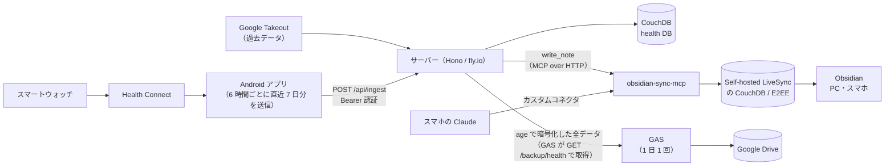

# sync-google-health-api

[](https://github.com/aomomo55/sync-google-health-api/actions/workflows/ci.yml)

Android の Health Connect に集まる健康データ（歩数・心拍・睡眠・体重など）を毎日自動で集め、Obsidian の Vault にダッシュボード付きのノートとして書き込むパイプラインです。
スマホの Claude アプリから、そのノートを読んで健康状態を振り返れるようにすることを目的にしています。

## 全体像



- **Android アプリ**が Health Connect から日ごとのサマリーを作り、サーバーへ送る
- **サーバー**がデータを保存し、日次・月次ノートとダッシュボードを生成して、[obsidian-sync-mcp](https://github.com/es617/obsidian-sync-mcp) 経由で Vault に書き込む（LiveSync の E2EE を保ったまま全端末に同期される）
- **Claude** は obsidian-sync-mcp のコネクタでノートを読み、分析する
- **GAS（Google Apps Script）** が 1 日 1 回サーバーから暗号化済みのバックアップを受け取り、Google Drive に保存する（[docs/backup.md](docs/backup.md)）

## 主な機能

- 日次ノート: 歩数・距離・消費カロリー・心拍・体重・体脂肪率・睡眠（就寝/起床時刻、深い・浅い・REM の内訳、仮眠）・摂取カロリーと P/F/C をプロパティとして持つ。利用者が書いたメモ欄は自動更新で消えない
- 月次ノートと、Dataview + Charts のグラフ・Bases の表を使ったヘルスケア/睡眠ダッシュボード（摂取と消費のカロリー、直近 1 週間の睡眠時間など）。自動で作るノートには、直接編集しても次の同期で戻る旨の注意書きを Obsidian のコメント（閲覧画面には出ない）で入れている
- Google Takeout（Google Fit 形式）からの過去データの一括取り込み
- 受信したデータの日と、その前後の日・月のノートだけを更新し、内容が変わらないノートは書き込まない（何度送り直しても結果が同じ）
- Vault への書き込みが一時的なエラー（通信の失敗、obsidian-sync-mcp の裏の DB のエラーなど）で失敗したら、間隔をあけてやり直す
- 値が範囲外の日（歩数の上限超えなど）はその日だけを保存せずに理由を返し、同じ送信の他の日は保存する
- Android アプリ: 6 時間ごとに直近 7 日分を自動で送るほか、ボタンで直近 7 日・過去 30 日・開始日（90 日前まで）からの範囲を送れる。保存されなかった日は日付と理由を画面に出す
- バックアップと復元: health DB の全期間を age の公開鍵で暗号化して Google Drive に毎日保存し（日次と週次の世代を残す）、手元の秘密鍵で復号して別の DB に書き戻せる

## 技術スタック

| 部分 | 技術 |
|---|---|
| サーバー | TypeScript, Hono, Node.js 24, zod, Vitest, MCP TypeScript SDK |
| データ保存 | CouchDB |
| Android アプリ | Kotlin, Jetpack Compose, Health Connect, WorkManager, OkHttp, kotlinx.serialization |
| インフラ | fly.io（Docker、自動停止・自動起動） |
| バックアップ | Google Apps Script、Google Drive、age（サーバー側は age-encryption） |
| ノート | Obsidian（Self-hosted LiveSync, Dataview, Charts, Bases） |

## リポジトリ構成

```
server/          サーバー、Takeout 取り込み・ノート同期・バックアップ復元のスクリプト（→ server/README.md）
android/         Health Connect のデータを送る Android アプリ（→ android/README.md）
gas/             バックアップを Google Drive に保存する Google Apps Script（GAS のエディタにコピーして使う）
docs/deploy.md   サーバーのデプロイと秘密情報の登録の手順
docs/backup.md   バックアップの設定と復元の手順
docs/adr/        設計判断の記録（Architecture Decision Records）
AGENTS.md        エージェント向けの指示（全体の約束。ディレクトリごとの指示は server/ などの AGENTS.md）
REVIEW.md        PR をレビューするときの観点
```

サーバーのコード（`server/src/`）は層に分けていて、層の一覧と依存の向きは [server/AGENTS.md](server/AGENTS.md#構成)、複数の層から使う汎用の部品の置き場所は [AGENTS.md](AGENTS.md#変更するときの約束) にあります。

## 設計で考えたこと

経緯は [docs/adr](docs/adr/README.md) に残しています。主なものは次のとおりです。

- **データの取得元**（[0001](docs/adr/0001-health-connect-as-data-source.md)）: Google Health API は新規プロジェクトの受付を停止しており、Fitbit Web API・Google Fit REST API も使えなかったため、端末内の Health Connect から自作アプリで送る方式にした
- **Vault への書き込み**（[0003](docs/adr/0003-livesync-cli-for-obsidian-writes.md) → [0007](docs/adr/0007-write-via-obsidian-sync-mcp.md)）: LiveSync の E2EE 形式を自前で実装すると Vault を壊すおそれがあるため、公式実装を使う方針で検討し、最終的に公式ライブラリを使う obsidian-sync-mcp に任せた。テスト用の Vault で書き込み・逆方向の同期・書き込み先の制限を検証してから採用した
- **ノートの生成**（[0006](docs/adr/0006-server-rendered-notes-from-notion-layout.md)）: Claude に Markdown を書かせると形式がぶれるため、サーバーが決まった形式で生成する
- **秘密情報の扱い**: トークンや認証情報は fly.io の secrets と Android Keystore に置き、ログやエラーメッセージに出さない。端末への貼り付けで紛れ込む制御文字は起動時に検出して止める
- **受信データの検証**（[0012](docs/adr/0012-input-validation-and-error-exposure.md)）: 形の誤りはリクエスト全体を拒否し、値の範囲の誤りはその日だけを拒否する。応答のエラー文には値を載せない
- **バックアップ**（[0015](docs/adr/0015-backup-health-db-to-google-drive.md)）: サーバーが age の公開鍵で暗号化してから渡すので、サーバー・GAS・Google Drive のどこから漏れても中身は読めない。取得用のトークンは書き込み用と分け、漏れても書き込みはできない
- **コードの約束**（[0016](docs/adr/0016-shared-for-cross-layer-utilities.md)、[0017](docs/adr/0017-design-principles.md)）: 複数の層から使う汎用の部品の置き場所と、DRY・KISS・YAGNI などの原則どうしがぶつかったときの線の引き方を決めている

## 使い方の流れ

1. CouchDB と obsidian-sync-mcp を用意する（Self-hosted LiveSync を使っている前提）
2. `server/` を fly.io にデプロイし、秘密情報を登録する（[docs/deploy.md](docs/deploy.md)）。値はシェルの履歴に残らないよう、`fly secrets import` に標準入力から渡す
3. 過去データがあれば Google Takeout から取り込み、`sync:notes` でノートとダッシュボードを書き込む
4. `android/` のアプリをビルドして端末に入れ、サーバーの URL と API トークンを設定する（[android/README.md](android/README.md)）
5. 必要ならバックアップを設定する。age の鍵の組を作り、`BACKUP_TOKEN` と `BACKUP_AGE_RECIPIENT` をサーバーに登録して、`gas/` のスクリプトを GAS に置く（[docs/backup.md](docs/backup.md)）

## 動作確認した環境

| 種類 | 環境 |
|---|---|
| スマートフォン | Nothing Phone (3a)（Android 16） |
| スマートウォッチ | CMF Watch Pro 2 |
| Obsidian プラグイン | Self-hosted LiveSync 1.0.34、Dataview、Charts |
| Vault への書き込み | obsidian-sync-mcp 0.7.1 |
| サーバー | Node.js 24（fly.io）、CouchDB 3 |

スマートウォッチのデータは、メーカーの公式アプリから Health Connect に書き込まれたもの（睡眠ステージ付き）で確認しています。端末やアプリによって Health Connect に書き込まれる項目は異なります。

## 制約

- obsidian-sync-mcp が LiveSync 1.0.33 以降の「ID キー」に対応するまで、LiveSync 側は ID キーをパスフレーズ由来にし、Obfuscate Properties を無効にしておく必要がある（[0007](docs/adr/0007-write-via-obsidian-sync-mcp.md)）
- Health Connect には Google Fit の Move Minutes やハートポイントに当たる項目がないため、運動時間はエクササイズの記録時間で近似している（[0008](docs/adr/0008-android-app-health-connect-mapping.md)）
- Android アプリから送れるのは 90 日前まで。今日を含む直近 30 日より前を送るには履歴の権限が要る（Health Connect が既定では権限を初めて許可した日の 30 日前より前を読ませないため）。90 日より前は Google Takeout から取り込む（[android/README.md](android/README.md#開始日を指定して送る)）
- バックアップの秘密鍵を失くすと、バックアップを復号できない（[docs/backup.md](docs/backup.md)）
- 個人用途（利用者 1 人）を前提にしている

## ライセンス

[MIT](LICENSE)
